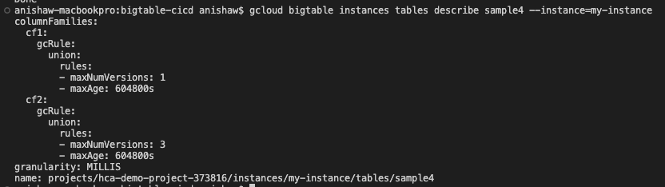
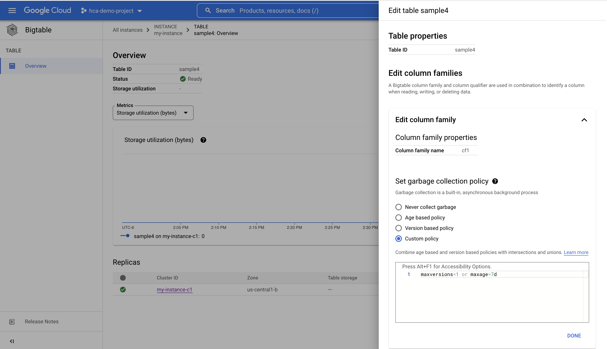
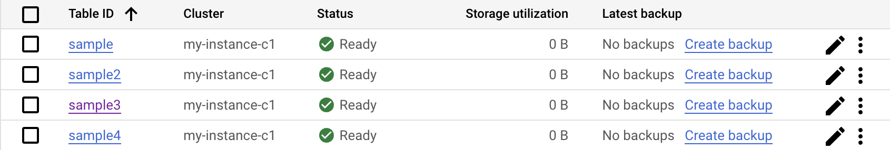

# Overview
This application will allow healthcare providers to apply schema changes to BigTable using Github Actions (CI/CD pipeline).

This application checks the directory for bigtable_schema_x.yaml files and creates a table if it doesn't already exist in BigTable. This is done with the use of Github actions and Google Cloud platform tools to apply schema changes to any BigTable instance during CI/CD processing.

# Architecture 


# Build instructions
### Prerequisite
The following prerequisite is required for the build

1. [Installed Google Cloud SDK](https://cloud.google.com/sdk/docs/install)

### Create BigTable schema files

1. Use the same naming convention for all schema files
```sh

bigtable_schema_<table_id>.yaml

```

2. Create a YAML file with the following syntax
```sh

project_id: <project_id>
instance_id: <instance_name>
table_id: <table_name>
cluster_id: <cluster_id>
column_families:
- name: <column_family_name1>
  max_versions_rule: 2
  max_age_rule: 7
- name: <column_family_name2>
  max_versions_rule: 2
  max_age_rule: 7
app_profile:
  name: <app_profile_id>
  routing_policy: single-cluser or multi-cluster
  single_row_transaction: true or false

```
|Variable Name|Description|
|---|---|
|project_id|Provide your project id |
|instance_id| Provide your Bigtable insance id |
|table_id| Provide your Bigtable table id |
|cluster_id| Provide your Bigtable cluster id |

|Column Families Variable Name|Description|
|---|---|
|name|Provide the name of the column family|
|max_versions_rule|Configure the maximum number of versions for cells in a table|
|max_age_rule|Configure the maximum age (in days) for cells in a table|

|App Profile Variable Name|Description|
|---|---|
|name|Provide the app profile id|
|routing_pollicy|Specify whether the cluster routing is single-cluster or multi-cluster|
|single_row_transaction|Boolean option to llow single-row transactions for single-cluster routing (always set to false for multi-cluster|

Note: Cluster configuration is automatically set to any cluster for multi-cluster routing

### Column Family Rules
The following code in **apply_schema.py** applies a union to the max_versions_rule and max_age_rule so that once one of the rules is met, the specific column family is no longer needed.

```sh

column_families[cf['name']] = column_family.GCRuleUnion(rules=[max_versions_rule, max_age_rule_])

```

Validating column family rules in the command line:

```sh

gcloud bigtable instances tables describe <table_id> --instance=<instance_id>

```


Validating column family rules in the console:

1. Navigate to Bigtable
2. Click on the appropriate instance
3. Click on 'Tables' in the left pane
4. Click on the appropriate table
5. Click on 'EDIT TABLE' in the top right corner 
6. Click the down arrow on the appropriate column family to see the following output



### Utilizing Python Script 
You can run the python script using the command below. This will scan the directory for all files using the naming convention (bigtable_schema_x.yaml). Then, it will read all the specified configurations in the YAML file to create the output in Bigtable.

```sh

python3 apply_schema.py

```

You can create a table and apply the schema using the command below.

```sh

gcloud bigtable instances tables create <table_id> --instance=<instance_id> --column-families=<bigtable_schema_x.yaml>

```

You can delete a table using the command below.

```sh

gcloud bigtable instances tables delete <table_id> --instance=<instance_id>

```

### Utilizing Github Action
Once the schema files are committed to the git repository, the github action will run the python script which create the output in Bigtable.

# Output 
The output in Bigtable will look like the following 




# References
