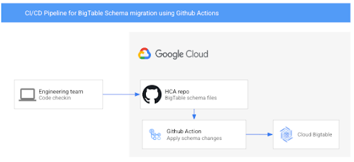

# Overview
This application will allow healthcare providers to apply schema changes to BigTable using Github Actions (CI/CD pipeline).

This application checks the directory for bigtable_schema_x.yaml files and creates a table if it doesn't already exist in BigTable. This is done with the use of Github actions and Google Cloud platform tools to apply schema changes to any BigTable instance during CI/CD processing.

# Architecture 

# Build instructions

 * `app.py` sourced from the [knative sample documentation](https://github.com/knative/docs/blob/master/docs/serving/samples/hello-world/helloworld-python/app.py)
 * `Dockerfile` sourced from the [knative sample documentation](https://github.com/knative/docs/blob/master/docs/serving/samples/hello-world/helloworld-python/Dockerfile)

## Contributions

Please see the [contributing guidelines](CONTRIBUTING.md)

## License

This library is licensed under Apache 2.0. Full license text is available in [LICENSE](LICENSE).
