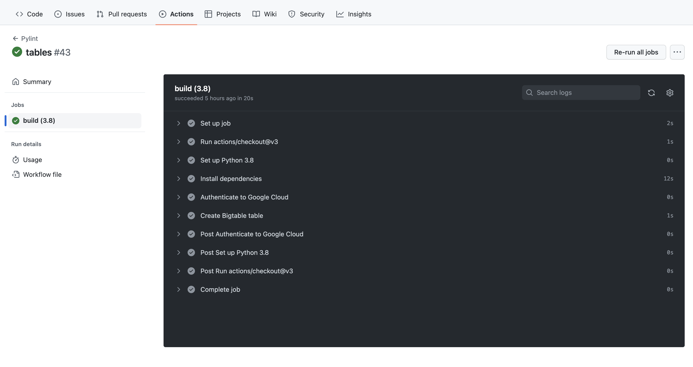
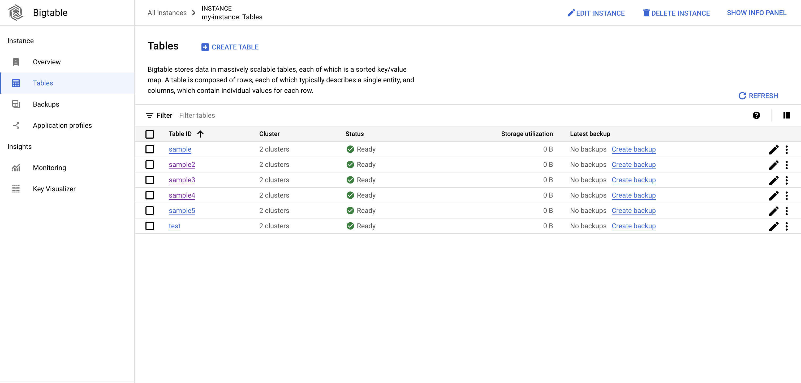
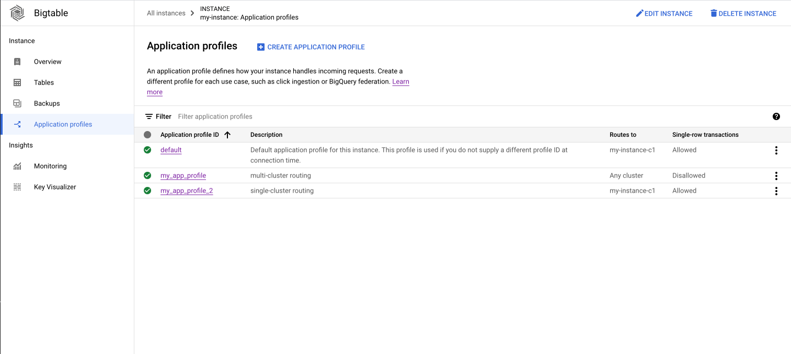
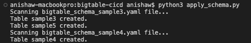
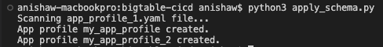

# Overview
This application will allow healthcare providers to apply schema changes to BigTable using Github Actions (CI/CD pipeline).

This application checks the directory for bigtable_schema_x.yaml files and creates a table if it doesn't already exist in BigTable. This is done with the use of Github actions and Google Cloud platform tools to apply schema changes to any BigTable instance during CI/CD processing.

# Architecture 


# Build instructions
### Prerequisite
The following prerequisites are required for the build:

1. [Installed Google Cloud SDK](https://cloud.google.com/sdk/docs/install)

2. Configure a secret
    - Navigate to the console and click on 'IAM & Admin'
    - Click on 'Service Accounts' on the left pane
    - Click '+ CREATE SERVICE ACCOUNT' and create a github service account
    - Click on the created service accoutn and navigate to 'KEYS' near the top of the page
    - Click on 'ADD KEY' and select the 'JSON' option
    - Navigate to the github repo and click on 'Settings > Secrets and variables > Actions > Actions Secret'
    - Click on 'New repository secret' and name it 'GOOGLE_CREDENTIALS' and copy the file that was downloaded from creating a key as the secret
    - Click 'Add secret' and then add to workflow

3. [Create a Bigtable cluster](https://cloud.google.com/bigtable/docs/creating-cluster)

### Create Bigtable schema files

1. Use the same naming convention for all schema files
```sh

bigtable_schema_<table_id>.yaml

```

2. Create a YAML file with the following syntax
```sh

project_id: <project_id>
instance_id: <instance_id>
tables:
  - table:
      name: <table_id>
      column_families:
        - name: <column_family_name1>
          max_versions_rule: <max_versions>
          max_age_rule: <max_age>
        - name: <column_family_name2>
          max_versions_rule: <max_versions>
          max_age_rule: <max_age>

```

***Note: You can include however many tables as needed***

|Table Variable Name|Description|
|---|---|
|project_id|Provide your project id |
|instance_id| Provide your Bigtable insance id |
|table_id| Provide your Bigtable table id |

|Column Families Variable Name|Description|
|---|---|
|name|Provide the name of the column family|
|max_versions_rule|Configure the maximum number of versions for cells in a table|
|max_age_rule|Configure the maximum age (in days) for cells in a table|

### Create App Profile schema files

1. Use the same naming convention for all schema files
```sh

app_profile<app_profile_id>.yaml

```

2. Create a YAML file with the following syntax
```sh

project_id: <project_id>
instance_id: <instance_name>
app_profiles:
  - app_profile:
      name: <app_profile_id>
      routing_policy: single-cluster or multi-cluster
      cluster_id: <cluster_id>
      single_row_transaction: true or false 
```

***Note: You can include however many app profiles as needed***

|App Profile Variable Name|Description|
|---|---|
|project_id|Provide your project id |
|instance_id| Provide your Bigtable insance id |
|app_profile_id| Provide your app profile id |

|App Profile Variable Name|Description|
|---|---|
|name|Provide the app profile id|
|routing_pollicy|Specify whether the cluster routing is single-cluster or multi-cluster|
|cluster_id|Provide the cluster id **(do not include parameter for multi-cluster)**|
|single_row_transaction|Boolean option to allow single-row transactions for single-cluster routing **(do not include parameter for multi-cluster)**|

***Note: Cluster configuration is automatically set to any cluster for multi-cluster routing***

# Column Family Rules
The following code in **apply_schema.py** applies a union to the max_versions_rule and max_age_rule so that once one of the rules is met, the specific column family is no longer needed.

```sh

column_families[cf['name']] = column_family.GCRuleUnion(rules=[max_versions_rule, max_age_rule_])

```

Validating column family rules in the command line:

```sh

gcloud bigtable instances tables describe <table_id> --instance=<instance_id>

```


Validating column family rules in the console:

1. Navigate to Bigtable
2. Click on the appropriate instance
3. Click on 'Tables' in the left pane
4. Click on the appropriate table
5. Click on 'EDIT TABLE' in the top right corner 
6. Click the down arrow on the appropriate column family to see the following output


# Utilizing Python Script 
You can run the python script using the command below. This will scan the directory for all files using the naming convention (bigtable_schema_x.yaml). Then, it will read all the specified configurations in the YAML file to create the output in Bigtable.

```sh

python3 apply_schema.py

```

You can create a table and apply the schema using the command below.

```sh

gcloud bigtable instances tables create <table_id> --instance=<instance_id> --column-families=<bigtable_schema_x.yaml>

```

You can delete a table using the command below.

```sh

gcloud bigtable instances tables delete <table_id> --instance=<instance_id>

```

# Utilizing Github Action
Once the schema files are committed to the git repository, the github action will run the python script which creates the output in Bigtable.

To check if the github action successfully ran, do the following:
- Click on 'Actions' on the top panel
- Click on the workflow that you want to inspect
- Click on 'build' under the 'Jobs' tab in the left panel to see the different steps of the github action as shown below 



# Console Output 
The console output to see the tables created in Bigtable will look like the following:



The console output to see the app profiles created in Bigtable will look like the following:



# Command Line Output

The command line output to see the tables created in Bigtable will look like the following:



The command output to see the app profiles created in Bigtable will look like the following:



# References
[1]  Setup gcloud GitHub Action https://github.com/google-github-actions/setup-gcloud

[2] cbt CLI reference https://cloud.google.com/bigtable/docs/cbt-reference

[3] Proof of Concept GCP project https://pantheon.corp.google.com/bigtable/instances?project=hca-demo-project-373816

[4] Github project for POC https://github.com/anandj123/bigtable-cicd

[5] BigTable python client library reference https://cloud.google.com/python/docs/reference/bigtable/latest/column-family
